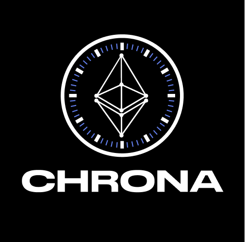

<div align="center">



# Kairo

### Rewarding real activity on-chain.

**Proof of Activity — mined by the wallets that actually use Solana.**

`$KAIRO` is an SPL token you don't buy your way into. You earn it by having been *active* on Solana: your wallet's real history — age, trades, volume, conviction — is its mining rig.

[Website](https://kairo.win) · [X / Twitter](https://x.com/MineKairo) · [Docs](docs/)

</div>

---

## The idea

Every other token rewards capital. Kairo rewards *activity*.

When you join, Kairo reads your wallet's on-chain life — how long you've been here, how much you've actually traded, the size of your flow, how long you hold what you buy — and distills it into a single number: your **score**. That score is your **hash rate**.

There's no GPU, no winner-take-all lottery. Every active wallet mines *simultaneously*, sharing each instant of emission in proportion to its share of the total network hash rate. A long-lived, high-conviction trader mines faster than a fresh wallet — but the fresh wallet still mines. Everyone who shows up gets a seat at the table; the table just isn't flat.

```
your share of this moment's emission  =  your hash rate / total network hash rate
```

## How it works

1. **Get scored.** Connect a wallet and Kairo previews your score for free — a transparent breakdown of age, trades, volume, and hold time. The scoring is open-source and deterministic: anyone can recompute your number from public data.
2. **Start mining.** Pay a one-time **0.1 SOL** initialization fee and register on-chain. From that moment your wallet is mining $KAIRO, 24/7, no hardware required.
3. **Claim.** Rewards accrue continuously. Claim whenever you like — the program mints fresh $KAIRO straight to your wallet.

## The emission curve

A sharp early burst that settles onto a long, steady plateau.

- **100,000** $KAIRO at genesis (the launch supply).
- **30,000** $KAIRO on day one, dropping fast — ~16,700 day two, ~10,500 day three — down to a **steady ~5,000 $KAIRO/day by day 10**, so the **earliest miners earn the most**.
- From there it holds near ~5,000/day for years (gently halving every ~8 years), approaching a hard ceiling of **21,000,000** $KAIRO it never quite reaches.

Mathematically it's the sum of two curves: a fast front-load spike plus a slow ~5k/day base. → [docs/tokenomics.md](docs/tokenomics.md)

## Built to be verified

Kairo is open-source end to end. The scoring algorithm is public and reproducible, every score is a signed, auditable attestation, and the on-chain program enforces the supply cap and reward math with no privileged minting. → [docs/oracle-trust.md](docs/oracle-trust.md)

The program is **deployed and formally verified on mainnet** — the on-chain bytecode provably matches this repo:

- Program: [`6MS8n87aRsXE5RjyVXuf9wcfARn5ut4m2YhBFE3kairo`](https://explorer.solana.com/address/6MS8n87aRsXE5RjyVXuf9wcfARn5ut4m2YhBFE3kairo)
- Verification: [verify.osec.io](https://verify.osec.io/status/6MS8n87aRsXE5RjyVXuf9wcfARn5ut4m2YhBFE3kairo)

Mining opens once the $KAIRO mint authority is handed to the program at token launch.

## On-chain addresses

| | Address |
|---|---|
| Program | `6MS8n87aRsXE5RjyVXuf9wcfARn5ut4m2YhBFE3kairo` |
| $KAIRO token (mint) | `HEZhbPyEoCNtEuiJh7hLuG8uuyiceUp2yduCVFKkairo` |
| Treasury | `B1xtqSHWRaGMpPkfgkFYPsLkvQKzF7pLUckTF53kairo` |

*The treasury is currently the deploy/upgrade authority; it receives the 0.1 SOL init and 0.02 SOL top-off fees.*

## Dig deeper

| | |
|---|---|
| **Architecture** — how the program, the scorer, and the dapp fit together | [docs/architecture.md](docs/architecture.md) |
| **Tokenomics** — the emission math, derived and validated | [docs/tokenomics.md](docs/tokenomics.md) |
| **Scoring spec** — exactly how a wallet becomes a hash rate | [docs/scoring-spec.md](docs/scoring-spec.md) |
| **Oracle & trust model** — what's trustless, what's trusted, and why | [docs/oracle-trust.md](docs/oracle-trust.md) |
| **On-chain program** | [programs/kairo](programs/kairo) |
| **Scorer oracle** | [scorer](scorer) |
| **Web app** | [app](app) |

---

<div align="center">
<sub>Kairo (καιρός) — the opportune moment. Mine it.</sub>
</div>
